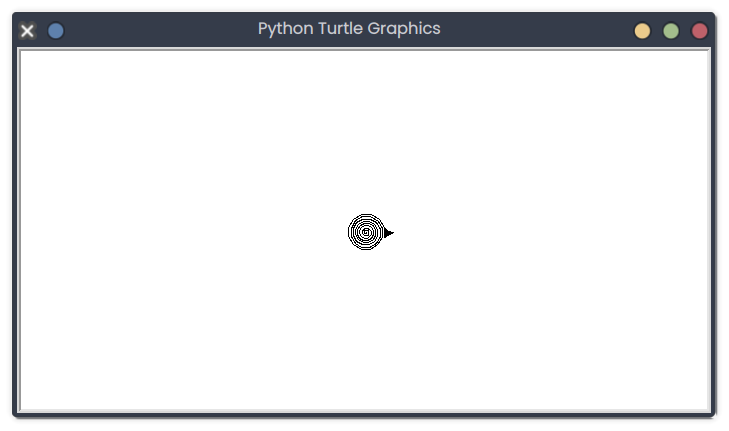

# Turtle Graphics

## Description
This snippet uses the `turtle` module to draw a simple spiral pattern.

## Code
```python
import turtle

def draw_spiral():
    t = turtle.Turtle()
    for i in range(100):
        t.forward(i / 10)
        t.right(30)
    turtle.done()

draw_spiral()
```

## Output
<div style="text-align: center;">
  
  <p></p>
</div>

*(Visual Output)*: A window displays a spiral pattern growing outward with 100 segments, each rotated 30 degrees.

## Explanation
- **Turtle Graphics**: Moves a virtual turtle to draw; `forward` moves, `right` rotates.
- **Spiral**: Increases segment length (`i/10`) and rotates 30 degrees each step.
- **Use Case**: Used in education, art, or geometric visualizations.
- **Best Practice**: Handle window closure; experiment with colors or shapes.