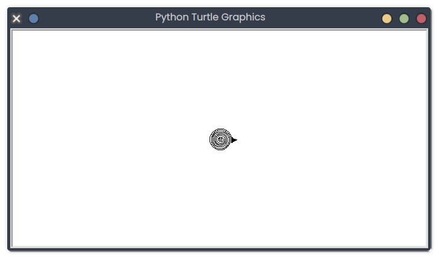

# Turtle Graphics

## Description
This snippet uses the `turtle` module to draw a simple spiral pattern.

## Code
```python
import turtle

def draw_spiral(auto_close=True):
    try:
        t = turtle.Turtle()
        for i in range(100):
            t.forward(i / 10)
            t.right(30)
        if auto_close:
            turtle.bye()  # close window when done
        else:
            turtle.done()
    except turtle.TurtleGraphicsError:
        # no display available (headless environment)
        print("Turtle graphics not available")

if __name__ == '__main__':
    draw_spiral()
```

## Output
<div style="text-align: center;">
  
  <p></p>
</div>

*(Visual Output)*: A window (when a display is available) shows a spiral pattern. Headless runs will simply print an error message.

## Explanation
- **Turtle Graphics**: Moves a virtual turtle to draw; `forward` moves, `right` rotates.
- **Spiral**: Increases segment length (`i/10`) and rotates 30 degrees each step.
- **Use Case**: Used in education, art, or geometric visualizations.
- **Best Practice**: Handle window closure; experiment with colors or shapes.