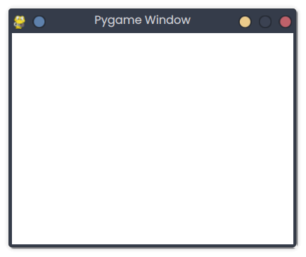

# Pygame Window

## Description
This snippet creates a basic Pygame window compatible with Pyodide for browser execution.

## Code
```python
import asyncio
import pygame
import platform

FPS = 60
WINDOW_WIDTH = 400
WINDOW_HEIGHT = 300

async def main():
    def setup():
        global screen
        pygame.init()
        screen = pygame.display.set_mode((WINDOW_WIDTH, WINDOW_HEIGHT))
        pygame.display.set_caption("Pygame Window")
    
    def update_loop():
        screen.fill((255, 255, 255))  # White background
        pygame.display.flip()
    
    setup()
    while True:
        for event in pygame.event.get():
            if event.type == pygame.QUIT:
                pygame.quit()
                return
        update_loop()
        await asyncio.sleep(1.0 / FPS)

if platform.system() == "Emscripten":
    asyncio.ensure_future(main())
else:
    if __name__ == "__main__":
        asyncio.run(main())
```

## Output
<div style="text-align: center;">
  
  <p></p>
</div>

*(Visual Output)*: A 400x300 white window titled "Pygame Window" appears in the browser.

## Explanation
- **Pygame Window**: Initializes a Pygame window using `pygame.display.set_mode`.
- **Pyodide**: Uses `asyncio` for browser compatibility, filling the screen white each frame.
- **Complexity**: O(1) per frame.
- **Use Case**: Foundation for Pygame applications or games.
- **Best Practice**: Handle events properly; ensure browser compatibility.