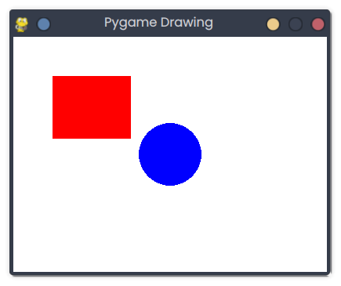

# Pygame Drawing

## Description
This snippet draws a red rectangle and a blue circle in a Pygame window, compatible with Pyodide.

## Code
```python
import asyncio
import pygame
import platform

FPS = 60
WINDOW_WIDTH = 400
WINDOW_HEIGHT = 300

async def main():
    def setup():
        global screen
        pygame.init()
        screen = pygame.display.set_mode((WINDOW_WIDTH, WINDOW_HEIGHT))
        pygame.display.set_caption("Pygame Drawing")
    
    def update_loop():
        screen.fill((255, 255, 255))  # White background
        pygame.draw.rect(screen, (255, 0, 0), (50, 50, 100, 80))  # Red rectangle
        pygame.draw.circle(screen, (0, 0, 255), (200, 150), 40)  # Blue circle
        pygame.display.flip()
    
    setup()
    while True:
        for event in pygame.event.get():
            if event.type == pygame.QUIT:
                pygame.quit()
                return
        update_loop()
        await asyncio.sleep(1.0 / FPS)

if platform.system() == "Emscripten":
    asyncio.ensure_future(main())
else:
    if __name__ == "__main__":
        asyncio.run(main())
```

## Output
<div style="text-align: center;">
  
  <p></p>
</div>

*(Visual Output)*: A 400x300 window with a red rectangle at (50,50,100,80) and a blue circle centered at (200,150) with radius 40.

## Explanation
- **Pygame Drawing**: Uses `pygame.draw.rect` and `pygame.draw.circle` to render shapes.
- **Pyodide**: `asyncio` loop ensures browser compatibility.
- **Complexity**: O(1) per frame.
- **Use Case**: Used in games or visualizations.
- **Best Practice**: Add dynamic shapes; optimize redraws.
