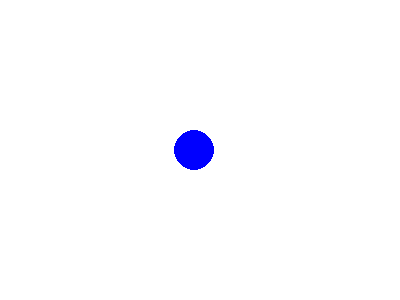

# Pygame Animation

## Description
This snippet animates a blue circle moving across a Pygame window, compatible with Pyodide.

## Code
```python
import asyncio
import pygame
import platform

FPS = 60
WINDOW_WIDTH = 400
WINDOW_HEIGHT = 300

async def main():
    def setup():
        global screen, x
        pygame.init()
        screen = pygame.display.set_mode((WINDOW_WIDTH, WINDOW_HEIGHT))
        pygame.display.set_caption("Pygame Animation")
        x = 0
    
    def update_loop():
        global x
        screen.fill((255, 255, 255))  # White background
        pygame.draw.circle(screen, (0, 0, 255), (x, 150), 20)
        x = (x + 2) % WINDOW_WIDTH  # Move right, wrap around
        pygame.display.flip()
    
    setup()
    while True:
        for event in pygame.event.get():
            if event.type == pygame.QUIT:
                pygame.quit()
                return
        update_loop()
        await asyncio.sleep(1.0 / FPS)

if platform.system() == "Emscripten":
    asyncio.ensure_future(main())
else:
    if __name__ == "__main__":
        asyncio.run(main())
```

## Output
<div style="text-align: center;">
  
  <p></p>
</div>

*(Visual Output)*: A 400x300 window with a blue circle (radius 20) moving right from x=0 to x=400, wrapping around continuously.

## Explanation
- **Pygame Animation**: Updates circle’s x-coordinate each frame for motion.
- **Pyodide**: `asyncio` ensures smooth animation in the browser.
- **Complexity**: O(1) per frame.
- **Use Case**: Used in games or interactive visualizations.
- **Best Practice**: Add speed control; handle multiple objects.