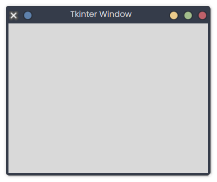

# Tkinter Window

## Description
This snippet creates a basic Tkinter window with a title.

## Code
```python
import tkinter as tk

root = tk.Tk()
root.title("Tkinter Window")
root.geometry("400x300")
root.mainloop()
```

## Output
<div style="text-align: center;">
  
  <p></p>
</div>

*(Visual Output)*: A 400x300 window titled "Tkinter Window" appears.

## Explanation
- **Tkinter Window**: Uses `tk.Tk()` to create a window; `geometry` sets size, `title` sets the title.
- **mainloop**: Runs the Tkinter event loop.
- **Use Case**: Foundation for GUI applications.
- **Best Practice**: Handle window closure; customize appearance.