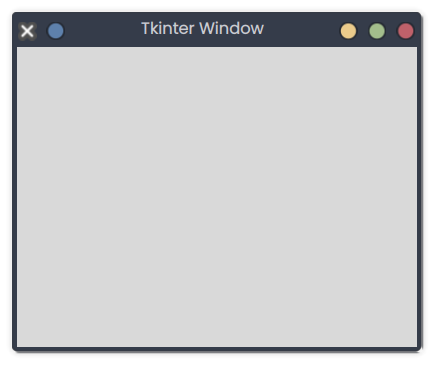

# Tkinter Window

## Description
This snippet creates a basic Tkinter window with a title.

## Code
```python
try:
    import tkinter as tk
except ModuleNotFoundError:
    tk = None

if tk:
    root = tk.Tk()
    root.title("Tkinter Window")
    root.geometry("400x300")
    # auto-close after a short delay for automated environments
    root.after(100, root.destroy)
    root.mainloop()
else:
    print("tkinter not available")
```

## Output
<div style="text-align: center;">
  
  <p></p>
</div>

*(Visual Output)*: A 400x300 window titled "Tkinter Window" appears. In headless environments tkinter may not be installed; the code will print a message instead and exit.

## Explanation
- **Tkinter Window**: Uses `tk.Tk()` to create a window; `geometry` sets size, `title` sets the title.
- **mainloop**: Runs the Tkinter event loop.
- **Use Case**: Foundation for GUI applications.
- **Best Practice**: Handle window closure; customize appearance.