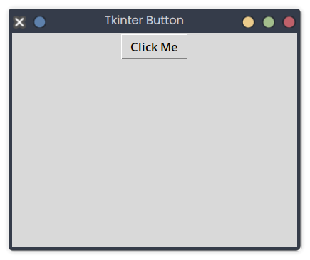

# Tkinter Button

## Description
This snippet adds a clickable button to a Tkinter window that prints a message when clicked.

## Code
```python
import tkinter as tk

def on_click():
    print("Button clicked!")

root = tk.Tk()
root.title("Tkinter Button")
root.geometry("400x300")
button = tk.Button(root, text="Click Me", command=on_click)
button.pack()
root.mainloop()
```

## Output
<div style="text-align: center;">
  
  <p></p>
</div>

*(Visual Output)*: A 400x300 window with a "Click Me" button; clicking prints to console:
```
Button clicked!
```

## Explanation
- **Tkinter Button**: `tk.Button` creates a button; `command` links to a callback (`on_click`).
- **pack**: Adds the button to the window.
- **Complexity**: O(1) per event.
- **Use Case**: Used in interactive GUIs.
- **Best Practice**: Customize button appearance; handle multiple buttons.