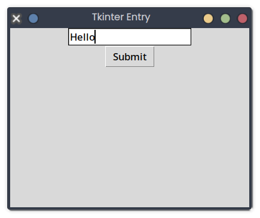

# Tkinter Entry

## Description
This snippet adds a text entry field to a Tkinter window, printing the input when a button is clicked.

## Code
```python
import tkinter as tk

def on_submit():
    print("Entered:", entry.get())

root = tk.Tk()
root.title("Tkinter Entry")
root.geometry("400x300")
entry = tk.Entry(root)
entry.pack()
button = tk.Button(root, text="Submit", command=on_submit)
button.pack()
root.mainloop()
```

## Output
<div style="text-align: center;">
  
  <p></p>
</div>

*(Visual Output)*: A 400x300 window with a text entry and "Submit" button; typing "Hello" and clicking prints:
```
Entered: Hello
```

## Explanation
- **Tkinter Entry**: `tk.Entry` creates a text input field; `get()` retrieves the text.
- **Button**: Triggers `on_submit` to print the input.
- **Complexity**: O(1) per event.
- **Use Case**: Used for user input in forms.
- **Best Practice**: Validate input; add labels or styling.