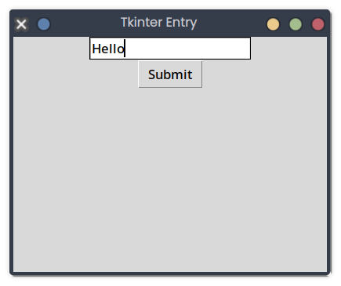

# Tkinter Entry

## Description
This snippet adds a text entry field to a Tkinter window, printing the input when a button is clicked.

## Code
```python
try:
    import tkinter as tk
except ModuleNotFoundError:
    tk = None

def on_submit():
    print("Entered:", entry.get())

if tk:
    root = tk.Tk()
    root.title("Tkinter Entry")
    root.geometry("400x300")
    entry = tk.Entry(root)
    entry.pack()
    button = tk.Button(root, text="Submit", command=on_submit)
    button.pack()
    # simulate typing and submit
    entry.insert(0, 'Hello')
    root.after(50, button.invoke)
    root.after(100, root.destroy)
    root.mainloop()
else:
    print("tkinter not available")
```

## Output
<div style="text-align: center;">
  
  <p></p>
</div>

*(Visual Output)*: A 400x300 window with a text entry and "Submit" button; typing "Hello" and clicking prints:
```
Entered: Hello
```
In headless or tkinter‑missing environments the script will simply say so and exit.

## Explanation
- **Tkinter Entry**: `tk.Entry` creates a text input field; `get()` retrieves the text.
- **Button**: Triggers `on_submit` to print the input.
- **Complexity**: O(1) per event.
- **Use Case**: Used for user input in forms.
- **Best Practice**: Validate input; add labels or styling.