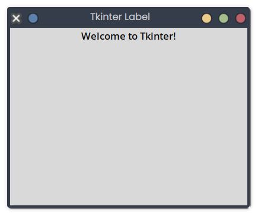

# Tkinter Label

## Description
This snippet adds a label to a Tkinter window to display static text.

## Code
```python
import tkinter as tk

root = tk.Tk()
root.title("Tkinter Label")
root.geometry("400x300")
label = tk.Label(root, text="Welcome to Tkinter!")
label.pack()
root.mainloop()
```

## Output
<div style="text-align: center;">
  
  <p></p>
</div>

*(Visual Output)*: A 400x300 window with the text "Welcome to Tkinter!" centered.

## Explanation
- **Tkinter Label**: `tk.Label` displays static text.
- **pack**: Adds the label to the window.
- **Use Case**: Used for instructions or titles in GUIs.
- **Best Practice**: Customize font, color, or alignment; update dynamically if needed.