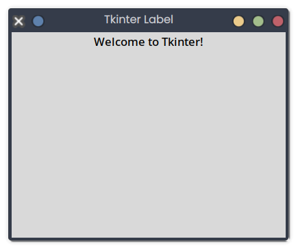

# Tkinter Label

## Description
This snippet adds a label to a Tkinter window to display static text.

## Code
```python
try:
    import tkinter as tk
except ModuleNotFoundError:
    tk = None

if tk:
    root = tk.Tk()
    root.title("Tkinter Label")
    root.geometry("400x300")
    label = tk.Label(root, text="Welcome to Tkinter!")
    label.pack()
    root.after(100, root.destroy)
    root.mainloop()
else:
    print("tkinter not available")
```

## Output
<div style="text-align: center;">
  
  <p></p>
</div>

*(Visual Output)*: A 400x300 window with the text "Welcome to Tkinter!" centered. If tkinter cannot be imported the script prints a notice and exits.

## Explanation
- **Tkinter Label**: `tk.Label` displays static text.
- **pack**: Adds the label to the window.
- **Use Case**: Used for instructions or titles in GUIs.
- **Best Practice**: Customize font, color, or alignment; update dynamically if needed.