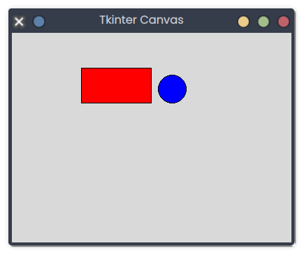

# Tkinter Canvas

## Description
This snippet uses a Tkinter canvas to draw a red rectangle and a blue oval.

## Code
```python
import tkinter as tk

root = tk.Tk()
root.title("Tkinter Canvas")
root.geometry("400x300")
canvas = tk.Canvas(root, width=300, height=200)
canvas.pack()
canvas.create_rectangle(50, 50, 150, 100, fill="red")
canvas.create_oval(160, 60, 200, 100, fill="blue")
root.mainloop()
```

## Output
<div style="text-align: center;">
  
  <p></p>
</div>

*(Visual Output)*: A 400x300 window with a 300x200 canvas containing a red rectangle (50,50,150,100) and a blue oval (160,60,200,100).

## Explanation
- **Tkinter Canvas**: `tk.Canvas` allows drawing shapes; `create_rectangle` and `create_oval` add shapes.
- **pack**: Adds the canvas to the window.
- **Use Case**: Used for custom graphics or simple games.
- **Best Practice**: Handle canvas size; add interactivity.