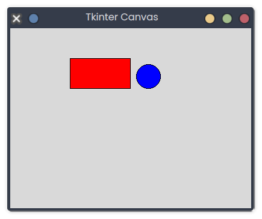

# Tkinter Canvas

## Description
This snippet uses a Tkinter canvas to draw a red rectangle and a blue oval.

## Code
```python
try:
    import tkinter as tk
except ModuleNotFoundError:
    tk = None

if tk:
    root = tk.Tk()
    root.title("Tkinter Canvas")
    root.geometry("400x300")
    canvas = tk.Canvas(root, width=300, height=200)
    canvas.pack()
    canvas.create_rectangle(50, 50, 150, 100, fill="red")
    canvas.create_oval(160, 60, 200, 100, fill="blue")
    root.after(100, root.destroy)
    root.mainloop()
else:
    print("tkinter not available")
```

## Output
<div style="text-align: center;">
  
  <p></p>
</div>

*(Visual Output)*: A 400x300 window with a 300x200 canvas containing a red rectangle (50,50,150,100) and a blue oval (160,60,200,100). If tkinter isn't available, the script prints a message instead.

## Explanation
- **Tkinter Canvas**: `tk.Canvas` allows drawing shapes; `create_rectangle` and `create_oval` add shapes.
- **pack**: Adds the canvas to the window.
- **Use Case**: Used for custom graphics or simple games.
- **Best Practice**: Handle canvas size; add interactivity.