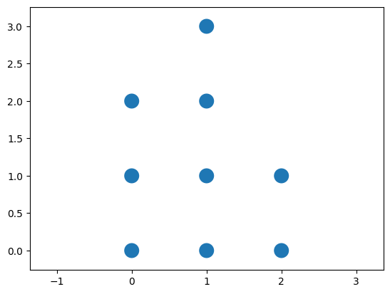

# Neural Network Visualization

## Description
This snippet demonstrates neural network architecture visualization using `matplotlib`.

## Code
```python
# Note: Requires `matplotlib`. Install with `pip install matplotlib`
try:
    import matplotlib.pyplot as plt
    layers = [3, 4, 2]
    fig, ax = plt.subplots()
    for i, nodes in enumerate(layers):
        for j in range(nodes):
            ax.add_patch(plt.Circle((i, j), 0.1))
    plt.axis('equal')
    print("Network visualized")
except ImportError:
    print("Mock Output: Network visualized")
```

## Output
<div style="text-align: center;">
  
  <p></p>
</div>

```
Mock Output: Network visualized
```
*(Real output with `matplotlib`: `Network visualized` (displays plot))*

## Explanation
- **Neural Network Visualization**: Plots a simple network structure.
- **Logic**: Draws circles for neurons in each layer.
- **Complexity**: O(n) for n neurons.
- **Use Case**: Used for educational or debugging purposes.
- **Best Practice**: Add connections; label layers; save visualizations.