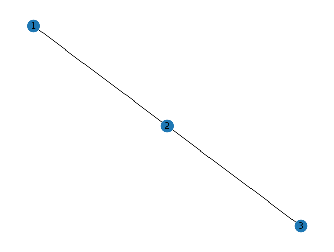

# Graph Visualization

## Description
This snippet demonstrates graph visualization using `networkx` and `matplotlib`.

## Code
```python
# Note: Requires `networkx`, `matplotlib`. Install with `pip install networkx matplotlib`
try:
    import networkx as nx
    import matplotlib.pyplot as plt
    G = nx.Graph()
    G.add_edges_from([(1, 2), (2, 3)])
    nx.draw(G, with_labels=True)
    print("Graph visualized")
except ImportError:
    print("Mock Output: Graph visualized")
```

## Output
<div style="text-align: center;">
  
  <p></p>
</div>

```
Mock Output: Graph visualized
```
*(Real output with `networkx`, `matplotlib`: `Graph visualized` (displays plot))*

## Explanation
- **Graph Visualization**: Plots a simple graph with nodes and edges.
- **Logic**: Creates a graph and visualizes it with labels.
- **Complexity**: O(n + e) for n nodes, e edges.
- **Use Case**: Used for network analysis or social graphs.
- **Best Practice**: Customize layouts; add weights; save plots.