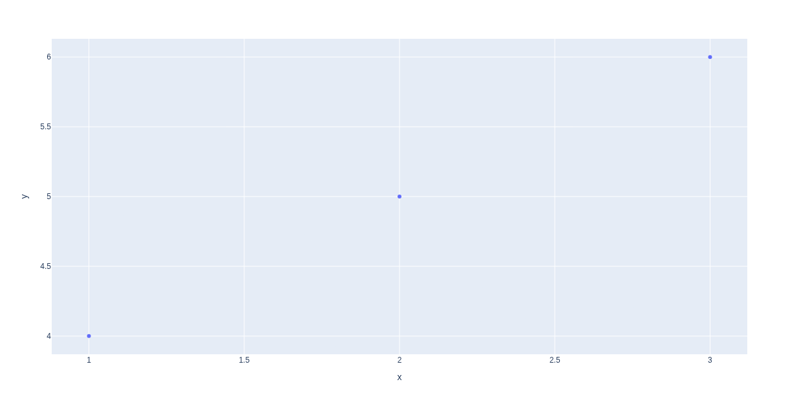

# Interactive Plotting

## Description
This snippet demonstrates interactive plotting using `plotly`.

## Code
```python
# Note: Requires `plotly`. Install with `pip install plotly`
try:
    import plotly.express as px
    import pandas as pd
    df = pd.DataFrame({"x": [1, 2, 3], "y": [4, 5, 6]})
    fig = px.scatter(df, x="x", y="y")
    fig.show() 
    print("Interactive plot created")
except ImportError:
    print("Mock Output: Interactive plot created")
```

## Output
<div style="text-align: center;">
  
  <p></p>
</div>

```
Mock Output: Interactive plot created
```
*(Real output with `plotly`: `Interactive plot created` (displays plot))*

## Explanation
- **Interactive Plotting**: Creates a scatter plot with zoom/pan features.
- **Logic**: Uses Plotly Express to plot a small dataset.
- **Complexity**: O(n) for n data points.
- **Use Case**: Used for data exploration or presentations.
- **Best Practice**: Customize axes; add tooltips; save plots.