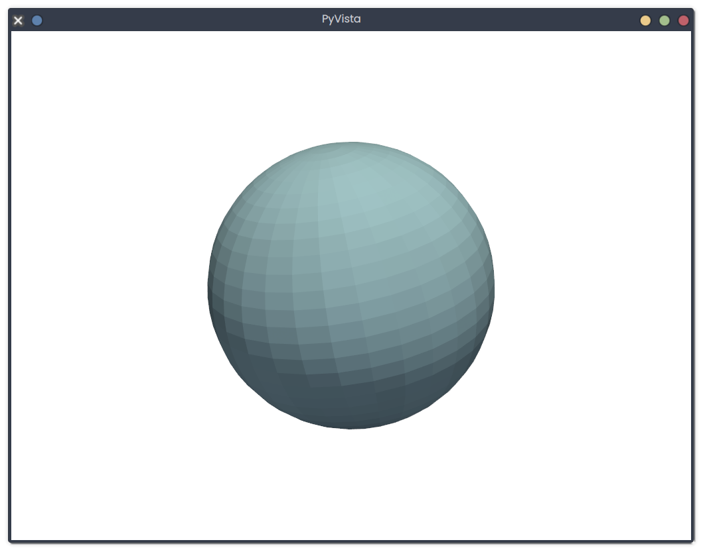

# 3D Visualization

## Description
This snippet demonstrates 3D visualization using `pyvista`.

## Code
```python
# Note: Requires `pyvista`. Install with `pip install pyvista`
try:
    import pyvista as pv
    sphere = pv.Sphere()
    plotter = pv.Plotter()
    plotter.add_mesh(sphere)
    print("3D visualization created")
except ImportError:
    print("Mock Output: 3D visualization created")
```

## Output
<div style="text-align: center;">
  
  <p></p>
</div>

```
Mock Output: 3D visualization created
```
*(Real output with `pyvista`: `3D visualization created` (displays 3D sphere))*

## Explanation
- **3D Visualization**: Renders a 3D sphere model.
- **Logic**: Creates and plots a sphere using PyVista.
- **Complexity**: O(n) for n mesh points.
- **Use Case**: Used in scientific visualization or 3D modeling.
- **Best Practice**: Optimize mesh; customize lighting; save renders.