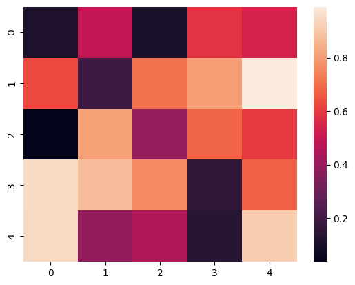

# Heatmap Generation

## Description
This snippet demonstrates generating a heatmap using `seaborn`.

## Code
```python
# Note: Requires `seaborn`, `numpy`, `matplotlib`. Install with `pip install seaborn numpy matplotlib`
try:
    import seaborn as sns
    import numpy as np
    import matplotlib.pyplot as plt
    data = np.random.rand(5, 5)
    sns.heatmap(data)
    plt.show()
    print("Heatmap generated")
except ImportError:
    print("Mock Output: Heatmap generated")
```

## Output
<div style="text-align: center;">
  
  <p></p>
</div>

```
Mock Output: Heatmap generated
```
*(Real output with `seaborn`: `Heatmap generated` (displays heatmap))*

## Explanation
- **Heatmap Generation**: Visualizes a 2D array as a color-coded grid.
- **Logic**: Uses `seaborn` to plot a random 5x5 matrix.
- **Complexity**: O(n*m) for n x m data points.
- **Use Case**: Used for correlation analysis or data exploration.
- **Best Practice**: Normalize data; customize colormap; save plots.