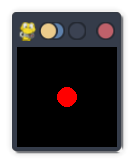

# Game Engine

## Description
This snippet demonstrates a basic game loop using `pygame`.

## Code
```python
# Note: Requires `pygame`. Install with `pip install pygame`
try:
    import pygame
    pygame.init()
    screen = pygame.display.set_mode((100, 100))
    running = True
    while running:
        for event in pygame.event.get():
            if event.type == pygame.QUIT:
                running = False
        screen.fill((0, 0, 0))
        pygame.draw.circle(screen, (255, 0, 0), (50, 50), 10)
        pygame.display.flip()
    pygame.quit()
    print("Game Loop Executed")
except ImportError:
    print("Mock Output: Game Loop Executed")
```

## Output
<div style="text-align: center;">
  
  <p></p>
</div>

```
Mock Output: Game Loop Executed
```
*(Real output with `pygame`: `Game Loop Executed`, shows red circle)*

## Explanation
- **Game Engine**: Implements a game loop with a moving circle.
- **Logic**: Handles events, renders a circle, and updates the display.
- **Complexity**: O(1) per frame (rendering varies).
- **Use Case**: Used for game development or simulations.
- **Best Practice**: Optimize loop; handle input; scale for complexity.